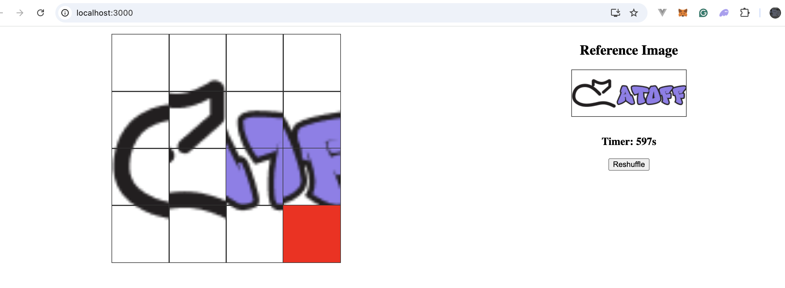

# Catoff Puzzle Game

## Overview

The **Catoff Puzzle Game** is an interactive sliding puzzle game designed around the Catoff logo. The goal of the game is to rearrange the scattered puzzle pieces back to their original form by sliding tiles into an empty space. The game includes a countdown timer for added challenge and competitiveness, and a reference image is provided for guidance.

## Features

- **Drag and Drop Sliding Puzzle**: Users can click on a tile adjacent to the empty space to slide it into the gap, gradually restoring the Catoff logo.
- **Timed Challenge**: The game includes a countdown timer set to **10 minutes**, creating a sense of urgency to solve the puzzle.
- **Reshuffle Button**: A button to reshuffle the puzzle pieces if the player wants to start a new challenge or reset the game.
- **Winning Condition**: The game checks if the pieces are arranged correctly to match the original image. Once the puzzle is solved, the player is declared the winner.
- **Reference Image**: A reference image of the completed Catoff logo is displayed beside the puzzle, assisting the player in solving the puzzle.
- **Smooth Animations**: The tiles smoothly slide into their new positions thanks to the `react-spring` library, creating a visually pleasing user experience.

## How It Works

1. **Puzzle Layout**: The puzzle consists of a **4x4 grid**, totaling 16 tiles. One of the tiles is empty, allowing the user to slide adjacent tiles into that empty space.
2. **Game Interaction**: The user clicks on a tile next to the empty space. When clicked, the tile slides smoothly into the empty space, and the puzzle pieces shift accordingly.
3. **Timer**: The game includes a countdown timer that starts at **10 minutes** and ticks down each second. The timer adds an element of competition to the game. When the timer reaches 0, the game ends.
4. **Reshuffling**: The reshuffle button resets the puzzle, scrambling the tiles randomly, and restarts the countdown timer.
5. **Winning Condition**: The game checks if the puzzle pieces are correctly arranged, matching the reference image. When this condition is met, the user wins the game.

## Installation

To run this puzzle game on your local machine, follow these steps:

1. Clone this repository:

    ```bash
    git clone https://github.com/okekechimezieglory/catoff-puzzle.git
    cd catoff-puzzle
    ```

2. Install dependencies:

    ```bash
    npm install
    ```

3. Start the development server:

    ```bash
    npm start
    ```

4. Open your browser and navigate to `http://localhost:3000` to start playing the game.

## Technologies Used

- **React**: The main JavaScript framework for building the interactive user interface.
- **react-spring**: A library for creating smooth and natural animations for the sliding tiles.
- **CSS Grid**: For the layout of the puzzle grid, ensuring the tiles are positioned correctly.
- **JavaScript (ES6+)**: For managing the game logic, including piece movements, timer functionality, and win condition checks.

## Screenshot



## Todo

I intend adding other features like wager, number of players, levels for competitiveness to it and as well integrate solana blinks into it.

## License

This project is licensed under the MIT License - see the [LICENSE](LICENSE) file for details.

